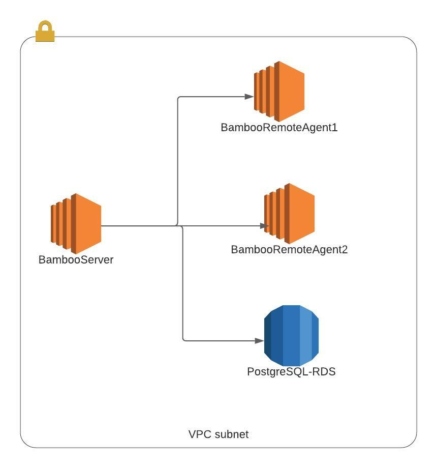

# Setting Up Bamboo Environment On AWS

## Table of Content:
1. [What is Bamboo?](#what-is-bamboo?)
2. [Goal](#goal)
3. [System Requirements](#system-requirements)
4. [Security Group]
5. [PostgreSQL RDS]
6. [Bamboo Server]
7. [Bamboo Remote Agent]

## What is Bamboo?

Bamboo is a continuous integration and deployment tool. Similar to Jenkins, but it is not open source. 
It is a commercial tool build by Atlassian.

## Goal

Implement the below architecture, where all components are hosted on AWS:

## System Requirements

 

- **Bamboo Server:**

    | Specification | Value |
    |:-------------:|:-----:|
    |AMI|Ubuntu Server 18.04 LTS (HVM), SSD Volume Type| 
    |Machine Type| t2.xlarge|
    |vCPUs| 4|
    |Memory| 16 GiB|
    |Name| BambooServer|
    |Security Group| BambooSecGrp|

 

- **Bamboo Agent #1:**

    | Specification | Value |
    |:-------------:|:-----:|
    |AMI|Ubuntu Server 18.04 LTS (HVM), SSD Volume Type|
    |Machine Type| t2.medium|
    |vCPUs| 2|
    |Memory| 4 GiB|
    |Name| Bamboo-Agent-1|
    |Security Group| BambooSecGrp|

 

- **Bamboo Agent #2:**

    | Specification | Value |
    |:-------------:|:-----:|
    |AMI|Ubuntu Server 18.04 LTS (HVM), SSD Volume Type|
    |Machine Type| t2.medium|
    |vCPUs| 2|
    |Memory| 4 GiB|
    |Name| Bamboo-Agent-2|
    |Security Group| BambooSecGrp|

 

- **PostgreSQL RDS:**

    | Specification | Value |
    |:-------------:|:-----:|
    |Engine Type| PostgreSQL|
    |Version| PostgreSQL 11.6-R1|
    |Templates| Dev/Test|
    |DB instance identifier| bamboodb-instance|
    |username| postgres|
    |DB instance size| db.m5.xlarge (4 vCPUs, 16 GiB RAM, 4750 Mbps EBS) |
    | Public Access | YES |
    |Security Group| BambooSecGrp |
    |DB Port| 5432 |
    |DB Name| bamboo |

