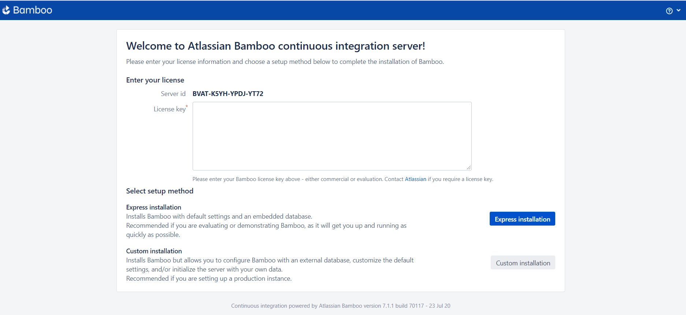
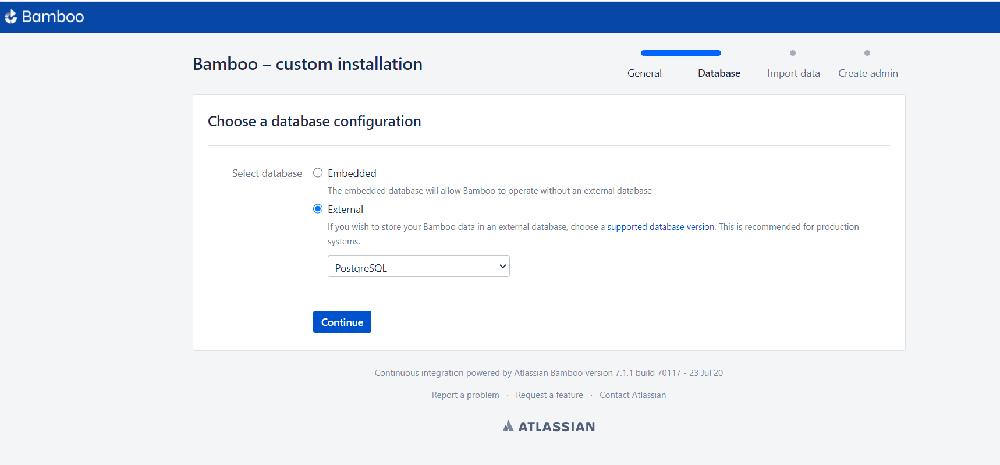
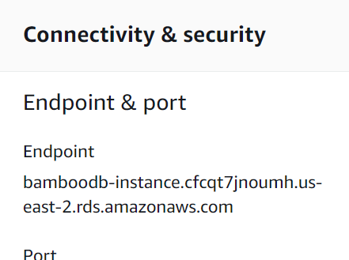
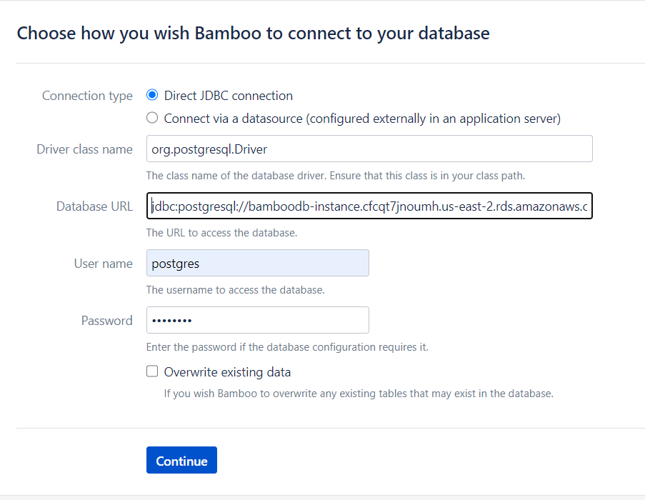
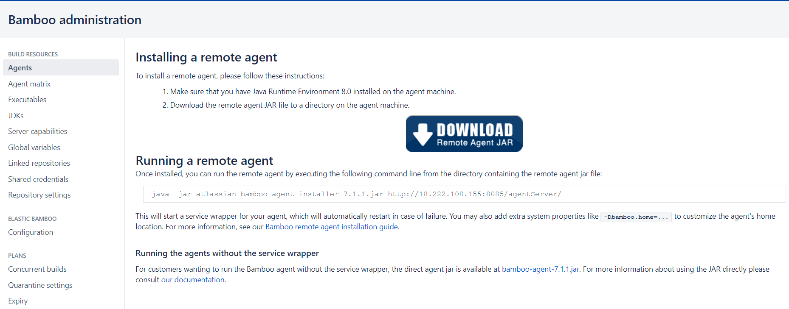
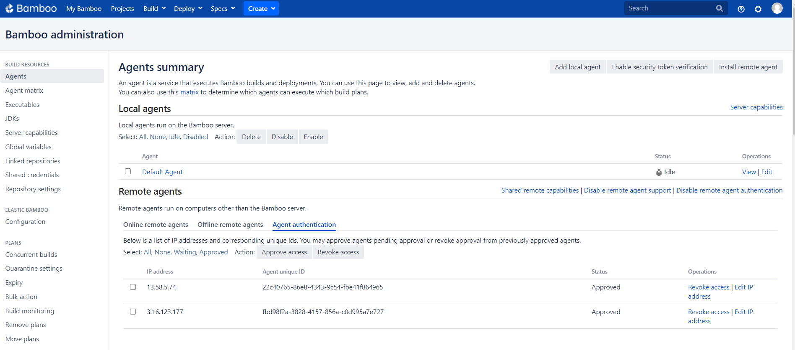

# Setting Up Bamboo Environment On AWS

## Table of Content:
1. [What is Bamboo?](#what-is-bamboo?)
2. [Goal](#goal)
4. [Security Group](#security-group)
3. [System Requirements](#system-requirements)
5. [PostgreSQL RDS](#postgresql-rds)
6. [Bamboo Server Setup](#bamboo-server-setup)
7. [Bamboo Remote Agent](#bamboo-agent-setup)
8. [Useful Resources](#useful-resources)


<hr>

## What is Bamboo?

Bamboo is a continuous integration and deployment tool. Similar to Jenkins, but it is not open source. 
It is a commercial tool build by Atlassian.

<hr>

## Goal

Implement the below architecture, where all components are hosted on AWS:


<hr>

## Security Group

- **BambooSecGrp:**

    Create a security-group under the used VPC, to used in all upcoming resources (Security can be much enhanced by adding only required IPs in Source, but it is okay for learning environment).
    
    - Inbound Rules:

        |Type|Protocol|Port Range|Source|Description|
        |:--:|:------:|:--------:|:----:|:---------:|
        |HTTP|TCP|80|0.0.0.0/0, ::/0|To access bamboo from browser|
        |PostgreSQL|TCP|5432|0.0.0.0/0, ::/0|To access RDS instance|
        |SSH|TCP|22|0.0.0.0/0, ::/0|To access EC2s|
        |Custom TCP|TCP|54663|0.0.0.0/0, ::/0|Used by bamboo in server-agent communication|
        |Custom TCP|TCP|8085|0.0.0.0/0, ::/0|Bamboo-Server listener|
       
    <br>

    - Outbound Rules:

        |Type|Protocol|Port Range|Destination|Description|
        |:--:|:------:|:--------:|:----:|:---------:|
        |All Trafic|All|All|0.0.0.0/0||

    <br>

<hr>


## System Requirements

<br>

- **Bamboo Server:**

    | Specification | Value |
    |:-------------:|:-----:|
    |AMI|Ubuntu Server 18.04 LTS (HVM), SSD Volume Type| 
    |Machine Type| t2.xlarge|
    |vCPUs| 4|
    |Memory| 16 GiB|
    |Name| BambooServer|
    |Security Group| BambooSecGrp|


<hr>

<br>

- **Bamboo Agent #1:**

    | Specification | Value |
    |:-------------:|:-----:|
    |AMI|Ubuntu Server 18.04 LTS (HVM), SSD Volume Type|
    |Machine Type| t2.medium|
    |vCPUs| 2|
    |Memory| 4 GiB|
    |Name| Bamboo-Agent-1|
    |Security Group| BambooSecGrp|

<hr>
<br>

- **Bamboo Agent #2:**

    | Specification | Value |
    |:-------------:|:-----:|
    |AMI|Ubuntu Server 18.04 LTS (HVM), SSD Volume Type|
    |Machine Type| t2.medium|
    |vCPUs| 2|
    |Memory| 4 GiB|
    |Name| Bamboo-Agent-2|
    |Security Group| BambooSecGrp|

<hr>


## PostgreSQL RDS

<br>

| Specification | Value |
|:-------------:|:-----:|
|Engine Type| PostgreSQL|
|Version| PostgreSQL 11.6-R1|
|Templates| Dev/Test|
|DB instance identifier| bamboodb-instance|
|username| postgres|
|DB instance size| db.m5.xlarge (4 vCPUs, 16 GiB RAM, 4750 Mbps EBS) |
| Public Access | YES |
|Security Group| BambooSecGrp |
|DB Port| 5432 |
|DB Name| bamboo |

<hr>


## Bamboo Server Setup

- Install Java OpenJDK-8:

    ```
        sudo apt-get update;
        sudo apt-get install -y openjdk-8-jdk;
    ```

- Make sure of the path where java is installed:

    ```
        update-alternatives --config java
    ```

- Add JAVA_HOME environment variable in **/etc/environment** :

    ```
        JAVA_HOME=/usr/lib/jvm/java-8-openjdk-amd64
    ```

    ```
        source /etc/environment
    ```

- Download and extract Bamboo-Server:

    ```
        wget https://www.atlassian.com/software/bamboo/downloads/binary/atlassian-bamboo-7.1.1.tar.gz
    ```
    ```
        tar xzf atlassian-bamboo-7.1.1.tar.gz
    ```

- Setup Bamboo's home directory:

    ```
        mkdir /home/ubuntu/BambooHome
    ```

    Uncomment and edit line in **atlassian-bamboo-7.1.1/atlassian-bamboo/WEB-INF/classes/bamboo-init.properties** :

    ```
        bamboo.home=/home/ubuntu/BambooHome
    ```

- Start Bamboo-Server: 

    ```
        ./atlassian-bamboo-7.1.1/bin/start-bamboo.sh
    ```

- Open Bamboo-Server in a browser:

    ```
        <BambooServer IPv4 Public IP>:8085
    ```




- Generate trial-license from [here](https://my.atlassian.com/license/evaluation)

- Choose **"Custom Installation"** to connect your rds.


- Choose **"External Database"**




- Replace **localhost** by your rds endpoint:





- Follow [this](https://confluence.atlassian.com/bamboo/running-the-setup-wizard-289276851.html) tutorial to complete setup wizard.


<hr>


## Bamboo Remote Agent

<br>

- Go to **Agents** --> **Install remote agent** in **BambooServer**.



- SSH to "BambooRemoteAgent.

- Install Java OpenJDK-8:

    ```
        sudo apt-get update;
        sudo apt-get install -y openjdk-8-jdk;
    ```

- Make sure of the path where java is installed:

    ```
        update-alternatives --config java
    ```

- Add JAVA_HOME environment variable in **/etc/environment** :

    ```
        JAVA_HOME=/usr/lib/jvm/java-8-openjdk-amd64
    ```

    ```
        source /etc/environment
    ```

- Follow the mentioned steps in "Installing a remote agent".

- Approve the agent in BambooServer.

Follow [this](https://confluence.atlassian.com/bamboo/bamboo-remote-agent-installation-guide-289276832.html) tutorial to install remote agents.





<hr>


## Useful Resources

- [Install Bamboo on Linux](https://confluence.atlassian.com/bamboo/installing-bamboo-on-linux-289276792.html)

- [Running Setup Wizard For Bamboo Server](https://confluence.atlassian.com/bamboo/running-the-setup-wizard-289276851.html)

- [Bamboo remote agent installation guide](https://confluence.atlassian.com/bamboo/bamboo-remote-agent-installation-guide-289276832.html)
